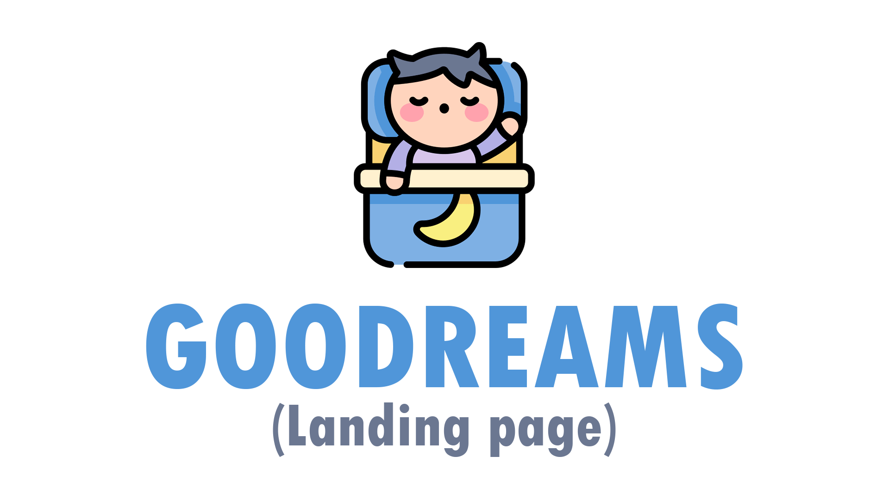

  

  
  
# landing-page-goodreams

  
### Description
The site uses [Html, CSS, PHP] technologies.
  
The goal is to inform the user of the best time to go to bed, enjoy a pleasant night's sleep and be productive the next day.
  
  - Site only available in PT-BR.

### Currently
This is just the landing page of the project, responsive to computers only. I plan to bring the complete project soon.

### Deploy
https://goodreams.netlify.app/
